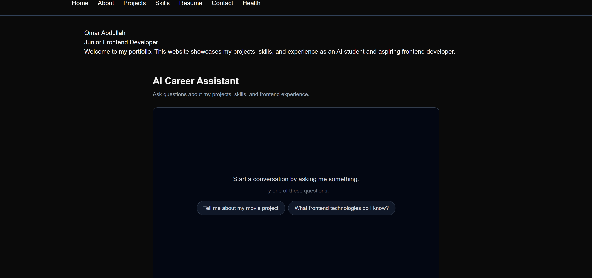
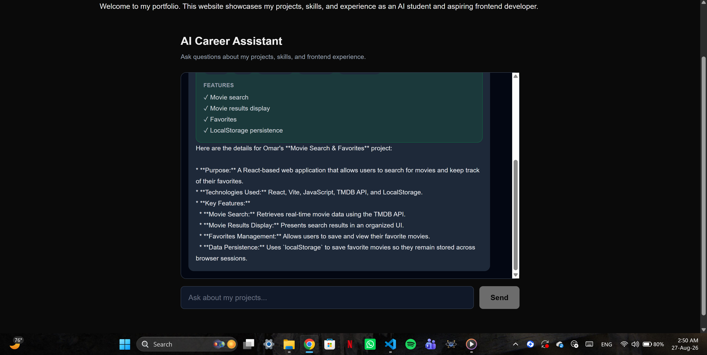
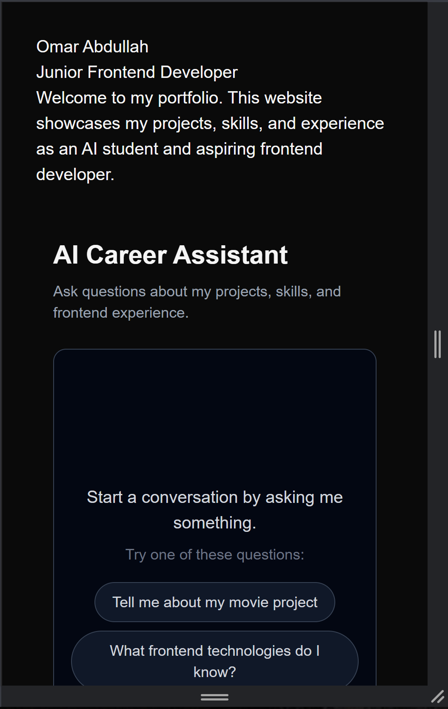

# AI Career Assistant

A production-ready AI-powered portfolio website built with Next.js. It allows visitors to explore my projects, skills, frontend experience, and interact with an AI Career Assistant that can retrieve structured project information through a server-side tool.

## Live Demo

**Production:** [Live Demo](https://frontend-ai-capstone-next.vercel.app/)

## Screenshots

### Portfolio



### AI Career Assistant




### Responsive Design


---

## What It Does

The website presents my developer portfolio while providing an AI-powered way for recruiters and visitors to ask questions about my:

* Projects
* Frontend technologies
* Technical skills
* Development experience

The AI Career Assistant can also call a server-side `get_project_details` tool to retrieve structured information about portfolio projects and display the result as a real UI component.

---

## Features

* AI-powered career assistant
* Server-side AI tool calling
* Structured project information
* Generative UI for tool results
* Tool lifecycle states:

  * Input streaming
  * Input available
  * Output available
  * Output error
* Responsive portfolio pages
* Accessible chat interface
* Loading and error states
* Stop AI response functionality
* Retry failed AI responses
* Automatic chat scrolling
* Jump-to-latest control
* Protected AI route with input limits
* Streaming response timeout
* Automated unit/component tests
* Automated cross-browser E2E testing

---

## Tech Stack

| Technology           | Purpose                              |
| -------------------- | ------------------------------------ |
| Next.js              | Application framework                |
| React                | User interface                       |
| TypeScript           | Type-safe development                |
| Tailwind CSS         | Styling                              |
| Vercel AI SDK        | AI streaming and tool calling        |
| Google Generative AI | AI model provider                    |
| Zod                  | Tool input validation                |
| Vitest               | Unit/component testing               |
| Testing Library      | React component testing              |
| Playwright           | End-to-end and cross-browser testing |
| Vercel               | Production deployment                |

---

## Getting Started

### 1. Clone the repository

```bash
git clone https://github.com/omarhubgit/frontend-ai-capstone-next.git
cd frontend-ai-capstone-next
```

### 2. Install dependencies

```bash
npm install
```

### 3. Configure environment variables

Create a `.env.local` file in the project root:

```env
GEMINI_API_KEY=your_api_key_here
```

Do not commit `.env.local` or expose the API key publicly.

### Environment Variables

| Variable         | Required | Description                                                   |
| ---------------- | -------- | ------------------------------------------------------------- |
| `GEMINI_API_KEY` | Yes      | API key used by the server-side Google Generative AI provider |

### 4. Start the development server

```bash
npm run dev
```

Open:

```text
http://localhost:3000
```

---

## Architecture Overview

The application uses a Next.js App Router architecture.

```text
User
  │
  ▼
Portfolio UI
  │
  ├── Projects
  ├── Skills
  ├── About
  └── AI Career Assistant
          │
          ▼
      /api/chat
          │
          ├── Input validation
          ├── Google AI model
          ├── System prompt
          └── get_project_details tool
                  │
                  ▼
            Structured project data
                  │
                  ▼
             Generative UI
```

### Main areas

```text
app/
├── api/chat/
│   └── route.ts              # Server-side AI streaming endpoint
├── components/
│   └── chat/
│       └── Chat.tsx          # AI chat interface
├── about/
├── contact/
├── projects/
├── resume/
├── skills/
└── page.tsx

lib/
├── ai/
│   └── config.ts             # AI model and system prompt configuration
└── tools/
    └── project-tools.ts      # Server-side project lookup tool

tests/
└── Chat.test.tsx             # Component tests

e2e/
└── chat.spec.ts              # End-to-end chat test
```

---

## AI Tool Calling

The application includes a server-side tool called:

```text
get_project_details
```

The tool allows the AI to retrieve structured information about a portfolio project instead of relying only on unstructured text generation.

### Input

The tool accepts:

```ts
{
  projectName: string;
}
```

The input is validated with Zod.

### Output

A successful lookup returns:

```ts
{
  name: string;
  description: string;
  technologies: string[];
  features: string[];
}
```

### Tool Lifecycle

The chat UI renders different states during the tool call:

| State              | UI                                              |
| ------------------ | ----------------------------------------------- |
| `input-streaming`  | Shows that the project lookup is being prepared |
| `input-available`  | Shows the project being requested               |
| `output-available` | Displays the structured project card            |
| `output-error`     | Displays a user-friendly error state            |

This demonstrates the complete flow from an AI tool call to structured data rendered as a real frontend component.

---

## Production Protection

Because the AI endpoint is publicly accessible, the application includes basic protection against trivial abuse.

### Input limits

The `/api/chat` route limits:

* Maximum number of messages: **20**
* Maximum total text input: **8,000 characters**

Requests exceeding these limits are rejected before being sent to the AI model.

### Streaming duration

The AI route uses:

```ts
export const maxDuration = 30;
```

This provides a sensible maximum duration for a streaming AI request.

---

## Testing

The project includes automated tests for the main application flow.

### Unit and component tests

Run:

```bash
npm run test:run
```

The current test suite contains **11 passing tests**.

### Lint

Run:

```bash
npm run lint
```

### Production build

Run:

```bash
npm run build
```

### Cross-browser E2E tests

Run:

```bash
npx playwright test
```

The E2E flow is tested against:

* Chrome
* Firefox
* Safari/WebKit
* Mobile Safari/WebKit

The final cross-browser test pass completed successfully with **4/4 tests passing**.

---

## Engineering Decisions

### Server-side AI calls

The AI provider and API key remain on the server rather than being exposed to the browser.

### Structured tool results

Project information is returned as structured data so the frontend can render a dedicated project component instead of displaying raw JSON.

### Input protection

The public chat endpoint uses message and character limits to reduce the risk of excessive API usage.

### Streaming

AI responses are streamed to provide a more responsive chat experience.

### Accessibility

The interface includes accessible labels, semantic controls, live regions for assistant responses, keyboard-friendly interactions, and visible focus states.

### Responsive design

The portfolio and chat interface are designed to work across desktop and mobile layouts.

---

## How AI Tools Built This Project

AI tools were used as development assistants throughout the project rather than as a replacement for understanding or verification.

Specific uses included:

* Planning the application architecture
* Designing the AI chat flow
* Creating and refining the server-side `get_project_details` tool
* Designing the Zod input schema
* Implementing generative UI states
* Reviewing accessibility issues
* Creating and debugging automated tests
* Improving the Playwright cross-browser test
* Reviewing production-readiness concerns
* Drafting and improving project documentation

AI-generated suggestions were reviewed, tested, and adapted to the application's actual requirements.

The development process and reflections are documented separately in:

* `prompts.md`
* `AI-Reflection.md`

These files contain the prompts used during development and a detailed reflection on how AI tools contributed to the project.

---

## Deployment

The application is deployed to Vercel as a production Next.js application.

Before deployment, the project was verified with:

```bash
npm run lint
npm run test:run
npm run build
npx playwright test
```

All final checks passed.

The production deployment uses the required `GEMINI_API_KEY` environment variable configured in the deployment environment.

---

## Project Goals

This project was built as part of the FlyRank Frontend AI Engineering track to demonstrate practical skills in:

* React and Next.js development
* AI-powered frontend experiences
* Server-side AI tool calling
* Generative UI
* API protection
* Accessibility
* Automated testing
* Cross-browser compatibility
* Production deployment
* Technical documentation
